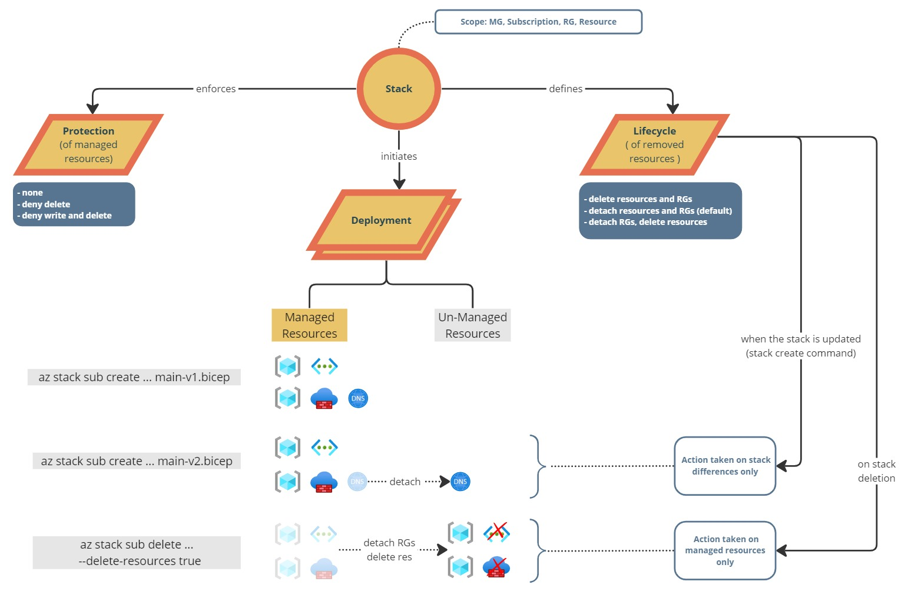

# Hello Deployment Stacks

Exploring Azure Deployment stack preview

Microsoft official docs : https://learn.microsoft.com/en-us/azure/azure-resource-manager/bicep/deployment-stacks?tabs=azure-cli

Overview



## Deployment

```
az login --tenant 7517bc42-bcf8-4916-a677
az account set --subscription c1537527-c126-428d-8f72

az deployment sub create --name "20230722.01" --template-file yaystack01.bicep --location westeurope
$deployment=az deployment sub create --name "20230722.01" --template-file yaystack01.bicep --location westeurope

($deployment | ConvertFrom-Json).properties.outputs.alphaName.value

```


## Deployment Stack

Some test on the lifecycle

### Init - one RG, two STO

```
$stack=az stack sub create --name "yaystack" `
  --template-file yaystack01.bicep --location westeurope `
  --deny-settings-mode "DenyDelete" `
  --delete-all false `
  --delete-resource-groups false `
  --delete-resources false


($stack | ConvertFrom-Json).outputs.alphaName.value
```


The "Deployment Stack" define the deployment name with the following naming convention: take({stack-name}-{timestamp}-{uniqueid}, 64)


### Add a third storage account, change a property of an existing STO

RESULT : new resource added to the stack, no unmanaged resources

```

az stack sub create --name "yaystack" `
  --template-file yaystack02.bicep --location westeurope `
  --deny-settings-mode "DenyDelete" `
  --delete-all false `
  --delete-resource-groups false `
  --delete-resources false

```


### Remove one storage

RESULT : stogamma moved to the unmanaged resources list but not deleted from Azure

```

az stack sub create --name "yaystack" `
  --template-file yaystack03.bicep --location westeurope `
  --deny-settings-mode "DenyDelete" `
  --delete-all false `
  --delete-resource-groups false `
  --delete-resources false

```


### Remove another storage and change the DELETE resource to TRUE

RESULT : 
* stobeta has been deleted from the stack and from Azure.
* no action has been taken on stogamma that was in the unmanaged. stogamma **IS NOT deleted**.
* the detached list is empty (I would prefer to still see the stogamma in the list).

```

az stack sub create --name "yaystack" `
  --template-file yaystack04.bicep --location westeurope `
  --deny-settings-mode "DenyDelete" `
  --delete-all false `
  --delete-resource-groups false `
  --delete-resources true

```

